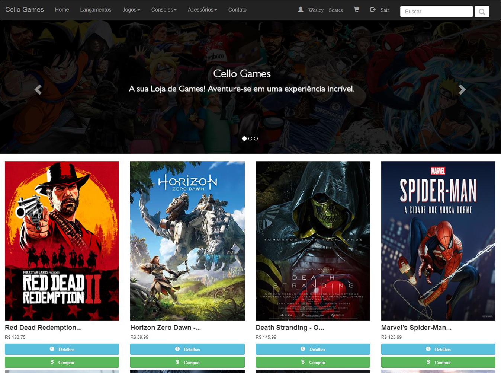
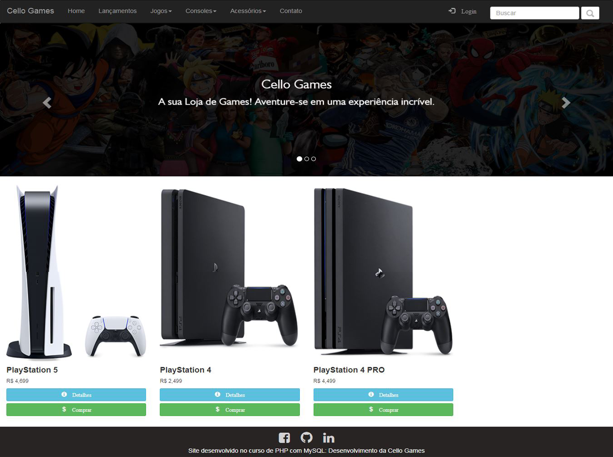
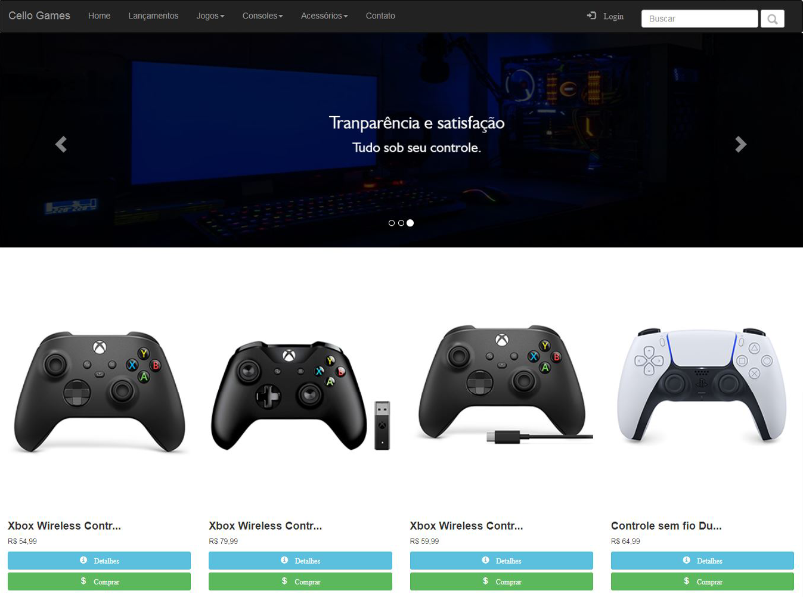
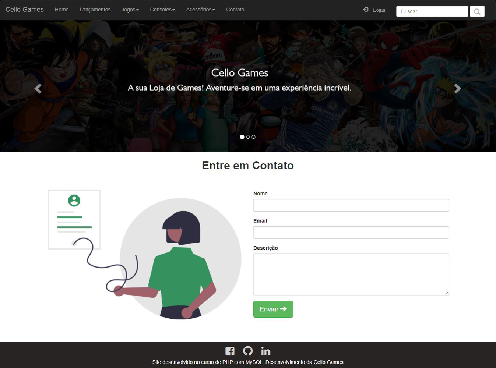
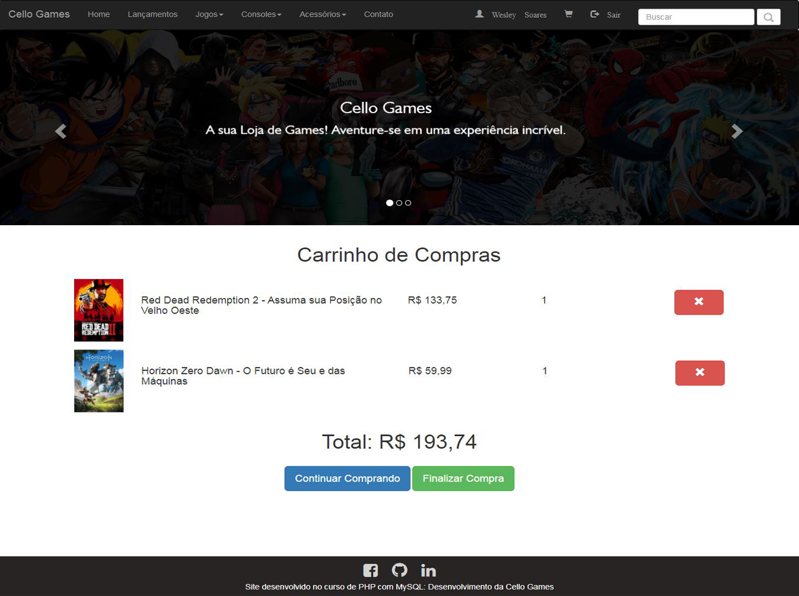
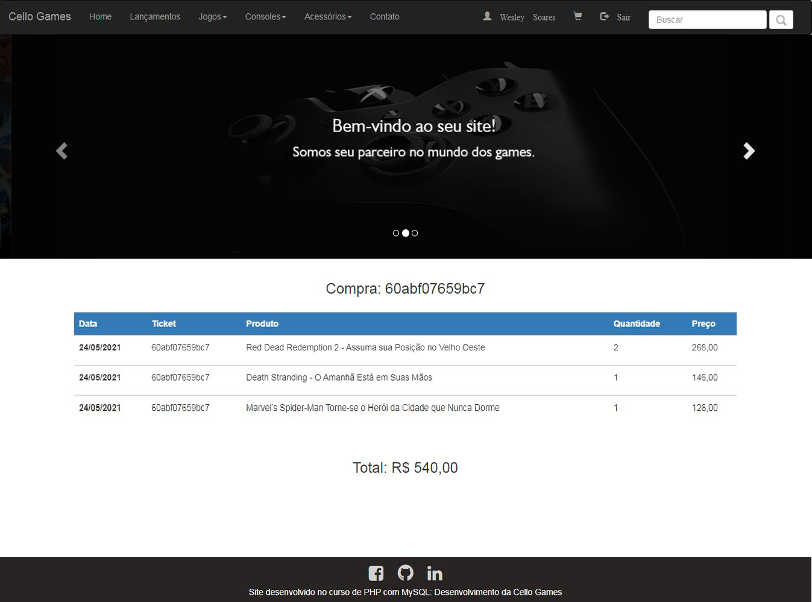
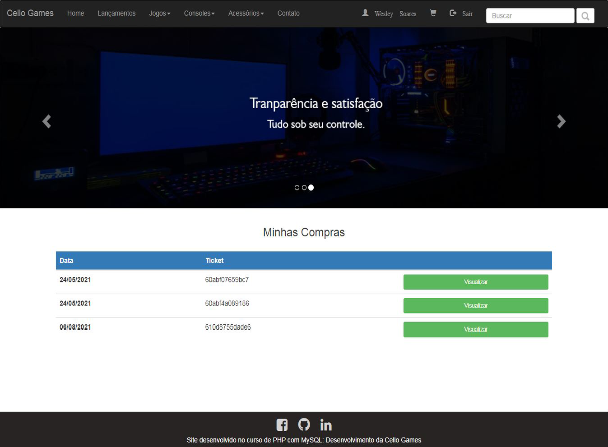
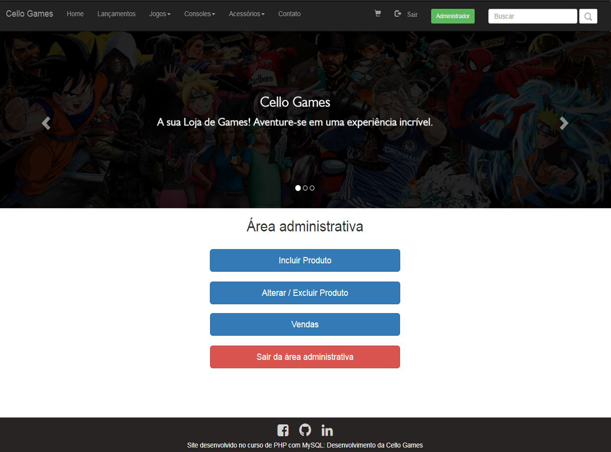

## Loja Virtual
Loja virtual de uma empresa de jogos fictícia, realizado junto com as aulas do professor [André Maurício](https://youtube.com/playlist?list=PL21XB6MnrdgA6loXEywpXoW-_Dw_zUasu). Projeto da empresa Cello Games.

#### Tecnologias utilizadas:
- Php
- Html
- Css
- JavaScript

#### Imagens:

